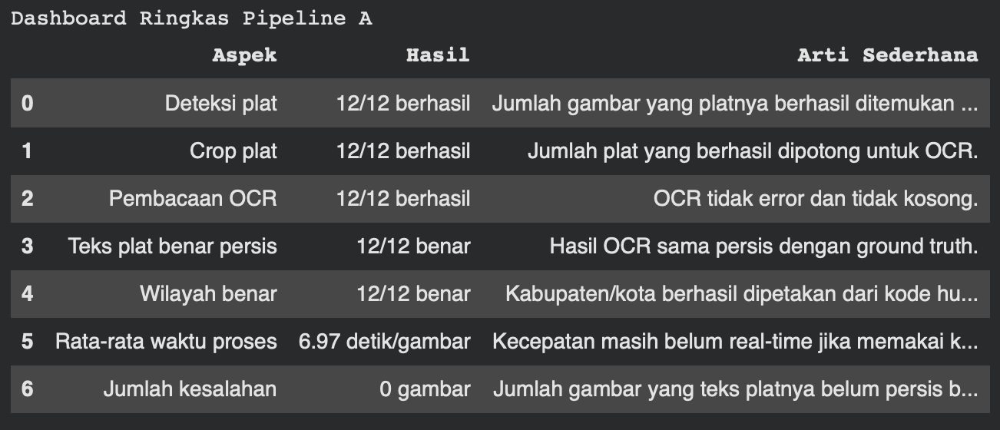
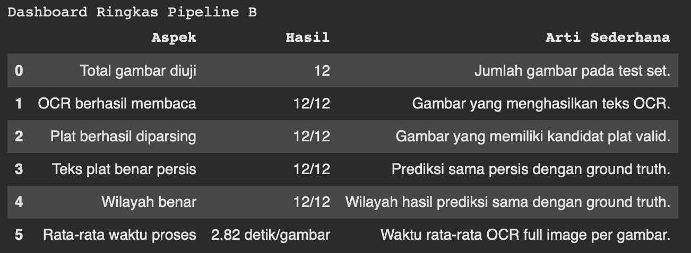
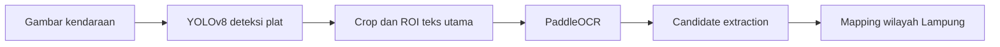
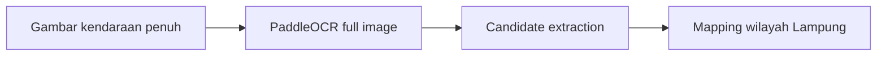

# ALPR Lampung License Plate Detection


Repository ini berisi dashboard inference untuk project **ALPR Lampung License Plate Detection**. Aplikasi menerima gambar kendaraan, membaca plat nomor Lampung dengan prefix `BE`, lalu memetakan kode huruf belakang plat ke kabupaten/kota di Provinsi Lampung.

Project ini dibuat sebagai proof-of-concept akademik. Streamlit hanya menjalankan inference/demo, bukan training ulang model dan bukan sistem produksi.

- Demo: [https://alpr-lampung.streamlit.app/](https://alpr-lampung.streamlit.app/)
- Repository: [https://github.com/HibbanRdn/Alpr-lampung.git](https://github.com/HibbanRdn/Alpr-lampung.git)

## Fitur Utama

- **Pipeline A: YOLOv8 + PaddleOCR**
  YOLOv8 mendeteksi lokasi plat, sistem mengambil crop dan ROI teks utama, lalu PaddleOCR membaca teks plat.

- **Pipeline B: Full Image PaddleOCR**
  PaddleOCR langsung membaca seluruh gambar tanpa YOLO dan tanpa crop. Pipeline ini dipakai sebagai baseline pembanding.

- **Compare A vs B**
  Menjalankan dua pipeline pada gambar yang sama dan menampilkan perbandingan prediksi plat, wilayah, OCR mentah, dan waktu proses.

- **Input manual plat**
  User dapat mengetik plat seperti `BE 1193 ALQ` untuk mengecek kode wilayah dan nama wilayah.

- **Visualisasi hasil prediksi**
  Pipeline A menampilkan bbox YOLO, crop plat, dan ROI teks utama. Pipeline B menampilkan OCR line pada gambar penuh.

## Preview Dashboard

Pipeline A:



Pipeline B:



## Alur Pipeline

Pipeline A:



Pipeline B:



## Struktur Repository

```text
alpr-lampung/
├── app.py
├── requirements.txt
├── runtime.txt
├── packages.txt
├── README.md
├── src/
│   ├── __init__.py
│   ├── config.py
│   ├── ocr_utils.py
│   ├── pipeline_a.py
│   ├── pipeline_b.py
│   ├── region_mapper.py
│   └── visualization.py
├── models/
│   └── yolov8n/
│       └── weights/
│           └── best.pt
├── results/
│   ├── pipeline_a/
│   │   └── technical_outputs/
│   └── pipeline_b/
│       └── technical_outputs/
├── assets/
│   ├── sample_images/
│   └── screenshots/
├── outputs/
│   ├── crops/
│   ├── roi/
│   ├── visualizations/
│   └── temp/
├── notebooks/
└── docs/
    └── notebook_workflow.md
```

Keterangan singkat:

| Path | Fungsi |
|---|---|
| `app.py` | Entry point Streamlit dashboard. |
| `src/pipeline_a.py` | Inference YOLOv8, crop/ROI plat, OCR, dan mapping wilayah. |
| `src/pipeline_b.py` | Inference PaddleOCR langsung pada full image. |
| `src/ocr_utils.py` | Parsing output PaddleOCR, normalisasi teks, dan candidate scoring. |
| `src/region_mapper.py` | Mapping kode huruf belakang plat Lampung ke wilayah. |
| `src/visualization.py` | Helper visualisasi bbox YOLO dan OCR line. |
| `src/config.py` | Konfigurasi path relatif repo, threshold YOLO, ROI, dan PaddleOCR. |
| `models/` | Lokasi weight YOLOv8 final. |
| `results/` | Artefak evaluasi dari notebook Pipeline A dan Pipeline B. |
| `assets/sample_images/` | Beberapa gambar contoh untuk demo. |
| `assets/screenshots/` | Screenshot dashboard atau visualisasi untuk dokumentasi. |
| `outputs/` | Output sementara saat runtime Streamlit. Folder ini masuk `.gitignore`. |
| `notebooks/` | Notebook eksperimen dari persiapan dataset sampai evaluasi pipeline. |
| `docs/notebook_workflow.md` | Ringkasan urutan notebook dan output penting. |

Aplikasi memakai path relatif dari repository. Tidak ada path runtime seperti `/content/drive/MyDrive/...` di Streamlit app.

## Pipeline yang Tersedia

### Pipeline A: YOLOv8 + PaddleOCR

Pipeline A adalah pipeline utama. Alurnya:

1. YOLOv8 mendeteksi area plat kendaraan.
2. Sistem memilih bbox dengan confidence tertinggi.
3. Area plat dipotong dengan padding kecil.
4. ROI teks utama diambil agar OCR lebih fokus ke karakter plat, bukan tanggal masa berlaku atau noise kecil.
5. PaddleOCR membaca teks dari crop/ROI.
6. Candidate extraction memilih kandidat plat terbaik dengan pola:

```text
BE + 1 sampai 4 digit angka + 1 sampai 3 huruf belakang
```

Contoh kandidat yang didukung:

```text
BE1193ALQ
BE8264FT
BE1943FL
BE1237FR
```

Pipeline ini membutuhkan model:

```text
models/yolov8n/weights/best.pt
```

### Pipeline B: Full Image PaddleOCR

Pipeline B tidak memakai YOLO dan tidak memakai crop plat. PaddleOCR langsung dijalankan pada gambar penuh. Candidate extraction kemudian memilih OCR line yang paling mirip dengan format plat Lampung.

Pipeline B digunakan sebagai baseline pembanding untuk melihat apakah tahap deteksi YOLO pada Pipeline A membantu mengurangi noise OCR.

### Compare A vs B

Mode ini menjalankan Pipeline A dan Pipeline B pada gambar yang sama. Dashboard menampilkan tabel:

```text
Pipeline | Plat Prediksi | Wilayah | OCR Raw | Waktu Proses | Catatan
```

Mode ini berguna untuk melihat perbedaan hasil ketika OCR diarahkan ke crop plat dibandingkan OCR langsung dari gambar penuh.

## Setup Model YOLO

Pipeline A membutuhkan model YOLOv8n hasil training:

```text
models/yolov8n/weights/best.pt
```

Jika file `best.pt` belum ada:

- Mode **Pipeline A** tidak dapat berjalan.
- Mode **Compare A vs B** tidak dapat berjalan penuh.
- Mode **Pipeline B** tetap dapat berjalan karena tidak memakai YOLO.

Jika weight model terlalu besar untuk GitHub, simpan model di Google Drive atau Hugging Face, lalu letakkan manual ke:

```text
models/yolov8n/weights/best.pt
```

Repository ini juga dapat menyimpan `last.pt` untuk arsip eksperimen, tetapi aplikasi Streamlit memakai `best.pt`.

## Instalasi Lokal

Disarankan menggunakan **Python 3.12**. PaddlePaddle/PaddleOCR dapat bermasalah pada Python yang terlalu baru, misalnya Python 3.14.

Clone repository:

```bash
git clone https://github.com/HibbanRdn/Alpr-lampung.git
cd Alpr-lampung
```

Buat virtual environment:

```bash
python -m venv .venv
source .venv/bin/activate
```

Untuk Windows:

```bash
.venv\Scripts\activate
```

Install dependency:

```bash
pip install -r requirements.txt
```

Jalankan aplikasi:

```bash
streamlit run app.py
```

## Dependency dan Runtime

File penting:

- `runtime.txt` berisi `python-3.12` untuk deployment.
- `.python-version` berisi `3.12` untuk tooling lokal yang mendukung pyenv/asdf.
- `packages.txt` berisi dependency sistem untuk OpenCV/PaddleOCR di Streamlit Cloud:

```text
libgomp1
libgl1
libglib2.0-0t64
```

`requirements.txt` memakai marker Python untuk dependency ML/OCR. Tujuannya agar Streamlit Cloud tidak gagal total jika runtime default terlalu baru. Untuk inference penuh, gunakan Python 3.12 agar paket berikut ikut terinstall:

```text
ultralytics
paddlepaddle
paddleocr
```

## Cara Menggunakan Dashboard

1. Jalankan aplikasi dengan `streamlit run app.py`.
2. Upload gambar kendaraan berformat JPG, JPEG, atau PNG.
3. Pilih mode inferensi di sidebar:
   - `Pipeline A: YOLOv8 + PaddleOCR`
   - `Pipeline B: Full Image PaddleOCR`
   - `Compare A vs B`
4. Klik tombol **Run Inference**.
5. Baca hasil prediksi plat, wilayah, OCR mentah, dan waktu proses.
6. Jika ingin mengecek mapping wilayah tanpa upload gambar, gunakan input manual di sidebar.

Output utama yang ditampilkan:

| Label UI | Arti |
|---|---|
| Plat Terdeteksi | Hasil akhir plat setelah OCR dan candidate extraction. |
| Kode Wilayah | Huruf pertama setelah angka plat yang dipakai untuk mapping wilayah. |
| Wilayah Prediksi | Kabupaten/kota Lampung hasil mapping. |
| Waktu Proses | Lama proses inference untuk gambar tersebut. |
| Teks OCR Mentah | Teks asli yang dibaca PaddleOCR sebelum dipilih kandidat terbaik. |
| Confidence Deteksi YOLO | Confidence bbox plat dari YOLOv8 pada Pipeline A. |
| Detail Teknis | Candidate score, OCR line terpilih, bbox, dan status pipeline. |

## Mapping Wilayah Lampung

Mapping dilakukan dari huruf pertama setelah angka utama plat. Contoh:

```text
BE 1193 ALQ -> kode wilayah A -> Kota Bandar Lampung
BE 1943 FL  -> kode wilayah F -> Kota Metro
BE 1498 GP  -> kode wilayah G -> Kab. Lampung Tengah
```

Ringkasan mapping:

| Kode | Wilayah |
|---|---|
| A, B, C, Y | Kota Bandar Lampung |
| F | Kota Metro |
| D, E, O | Kab. Lampung Selatan |
| M | Kab. Lampung Barat |
| G, H, I | Kab. Lampung Tengah |
| R | Kab. Pesawaran |
| U | Kab. Pringsewu |
| X | Kab. Pesisir Barat |
| N, P | Kab. Lampung Timur |
| J, K | Kab. Lampung Utara |
| V, Z | Kab. Tanggamus |
| W | Kab. Way Kanan |
| S, T | Kab. Tulang Bawang |
| Q | Kab. Tulang Bawang Barat |
| L | Kab. Mesuji |

## Hasil Evaluasi

Evaluasi batch dilakukan di notebook, bukan di Streamlit dashboard. File hasil yang tersedia di repository ini berada di:

```text
results/pipeline_a/technical_outputs/
results/pipeline_b/technical_outputs/
```

Ringkasan dari file evaluasi saat ini:

| Metrik | Pipeline A: YOLOv8 + OCR | Pipeline B: Full Image OCR |
|---|---:|---:|
| Split evaluasi | test | test |
| Jumlah gambar | 12 | 12 |
| Keberhasilan deteksi plat | 100% | Tidak berlaku |
| Keberhasilan crop plat | 100% | Tidak berlaku |
| Keberhasilan OCR | 100% | 100% |
| Kandidat plat ditemukan | 100% | 100% |
| Akurasi teks plat persis | 100% | 100% |
| Rata-rata CER | 0.000 | 0.000 |
| Akurasi karakter | 100% | 100% |
| Akurasi wilayah | 100% | 100% |
| Rata-rata waktu proses | 6.97 detik/gambar | 2.82 detik/gambar |

Catatan penting:

- Angka di atas berasal dari test set kecil berisi 12 gambar.
- Hasil tidak boleh dibaca sebagai jaminan performa pada semua kondisi.
- Kondisi pencahayaan, blur, sudut kamera, ukuran plat, dan background ramai dapat menurunkan performa OCR.
- Pipeline B terlihat kompetitif pada test set ini, tetapi konsepnya tetap lebih rentan membaca teks non-plat karena tidak memakai deteksi area plat.

File evaluasi utama:

```text
results/pipeline_a/technical_outputs/evaluation_summary_improved_v2.json
results/pipeline_a/technical_outputs/ocr_results_improved_v2.csv
results/pipeline_a/technical_outputs/candidate_debug_v2.csv
results/pipeline_b/technical_outputs/evaluation_summary_pipeline_b.json
results/pipeline_b/technical_outputs/ocr_results_pipeline_b.csv
results/pipeline_b/technical_outputs/candidate_debug_pipeline_b.csv
```

Jika file ringkasan ramah pembaca dari Colab ingin ditambahkan, letakkan di:

```text
results/pipeline_a/
results/pipeline_b/
```

## Alur Eksperimen Notebook

Dashboard ini adalah tahap akhir deployment/demo. Tahap eksperimen dilakukan dalam notebook terpisah:

1. Rename dataset.
2. Ground truth manual.
3. Roboflow annotation.
4. Polygon to bbox conversion.
5. Final split dataset.
6. YOLOv8 training.
7. Pipeline A evaluation.
8. Pipeline B evaluation.
9. Streamlit deployment.

Penjelasan detail setiap notebook tersedia di:

[docs/notebook_workflow.md](docs/notebook_workflow.md)

Streamlit tidak mengulang:

- rename dataset,
- konversi polygon ke bbox,
- split dataset,
- training YOLO,
- batch evaluation terhadap ground truth.

## Dataset dan Privasi

Dataset penuh tidak disertakan di repository agar repo tetap ringan dan untuk menjaga privasi. Repository hanya menyertakan beberapa sample image dan screenshot untuk demo/dokumentasi.

Gambar plat kendaraan dapat mengandung data sensitif. Hindari menyimpan, menyebarkan, atau mempublikasikan gambar kendaraan/plat tanpa izin. Folder `outputs/` masuk `.gitignore` agar hasil upload dan inference user tidak ikut ter-commit.

## Deployment Streamlit Cloud

Repository sudah disiapkan untuk Streamlit Community Cloud:

- `runtime.txt` mengunci Python 3.12.
- `packages.txt` menyediakan dependency sistem untuk OpenCV.
- `requirements.txt` memasang dependency dasar dan dependency ML/OCR pada Python yang kompatibel.
- App memberi warning jika runtime tidak memuat PaddleOCR atau Ultralytics.

Jika Streamlit Cloud tetap memakai Python terlalu baru dan inference gagal, buka:

```text
Manage app -> Settings -> Python version -> 3.12 -> Reboot/Redeploy
```

Jika muncul error OpenCV seperti `libGL.so.1` atau `libgthread-2.0.so.0`, pastikan `packages.txt` masih berisi:

```text
libgomp1
libgl1
libglib2.0-0t64
```

## Keterbatasan

- Dataset masih terbatas dan test set kecil.
- Sistem difokuskan pada plat Lampung dengan prefix `BE`.
- OCR dapat terganggu oleh blur, sudut ekstrem, pencahayaan buruk, pantulan, atau plat yang terlalu kecil.
- Pipeline B dapat membaca teks non-plat dari kendaraan, stiker, background, atau tanggal masa berlaku.
- Pipeline A bergantung pada kualitas deteksi YOLO. Jika bbox terlalu longgar atau gagal, OCR ikut terdampak.
- Inference belum dioptimasi untuk real-time.
- Aplikasi ini bukan sistem penegakan hukum dan tidak dirancang untuk penggunaan produksi.

## Pengembangan Lanjutan

- Menambah variasi dataset kendaraan, sudut kamera, cahaya, dan jarak.
- Fine-tuning OCR atau text recognizer khusus plat Indonesia.
- Optimasi inference agar lebih cepat di CPU.
- Menambahkan mode kamera/video real-time.
- Menyimpan riwayat inference secara opsional dengan kontrol privasi.
- Menambahkan evaluasi interaktif pada sample yang memiliki ground truth.
- Menyediakan model alternatif yang lebih ringan untuk deployment.

## Author

**M. Hibban Ramadhan**

Teknik Informatika, Universitas Lampung
